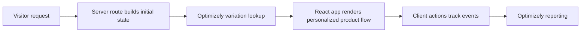

# Optimizely Full-Stack React Demo

Historical isomorphic React/Redux demo for Optimizely Full Stack experimentation.

This repository is a legacy demo application, not a current React reference app. Its value is the experimentation architecture: server-rendered product state, client-side activation/tracking, checkout-flow variations, and event reporting through the Optimizely SDK.

## What This Demonstrates

- Full-stack A/B testing with Optimizely's Node and JavaScript SDKs.
- Server-side rendering with Hapi, React, Redux, and hydrated client state.
- Experiment-driven product sorting and checkout-flow variations.
- Conversion tracking for add-to-cart and checkout-complete events.
- Product/solutions demo work around personalization and experimentation workflows.

## Experiment Flows



Implemented demo experiments:

- `sorting_experiment`
  - `sort_by_price`
  - `sort_by_name`
  - tracks `add_to_cart`
- `checkout_flow_experiment`
  - `one_step_checkout`
  - `two_step_checkout`
  - tracks `checkout_complete` with cart revenue

Relevant implementation files:

- `src/server/routes/views.js` computes application state with experiment data before server rendering.
- `src/common/action_creators/index.js` tracks client-side experiment events.
- `src/common/components/cart/index.js` activates the checkout-flow experiment.

## Running Locally

```bash
npm install
webpack
npm start
```

Then open `http://localhost:4242`.

## Repository Status

This is a historical demo from an older React/Hapi/Webpack stack. It should be read as evidence of experimentation architecture and GTM/product demo work, not as a modern frontend code sample.

Before using this as a live application, update dependencies, add tests, and replace any old Optimizely project configuration in `src/common/utils/enums.js`.
